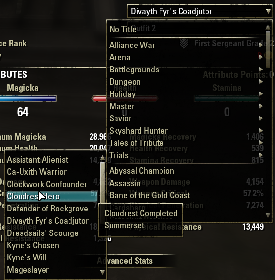

# LibScrollableMenu

<center></center>

The purpose of this plugin is to allow for creation of custom scrollable menus.

Originally developed in Kyoma's Titlizer.  Now used in ImprovedTitleizer.

GitHub: https://github.com/tomstock1337/eso-LibScrollableMenu

ESOUI.com (AddOns): https://www.esoui.com/downloads/fileinfo.php?id=3546

With update P40, API101040 ~2023-09-20 the ZO_ComboBox was changed into a ZO_ScrollableComboBox directly.
Some API functions beginning with ZO_ScrollableComboBox* changed to ZO_ComboBox* that way.
The main change was that ZO_Menu is not used any longer for the dropdown entries of ZO_ComboBox and thus
entries cannot be added/manipulated via other libraries about ZO_Menu, like the common lirary LibCustomMenu,
any longer!
That's why LibScrollableMenu got implemented additional features that LibCustomMenu provided, like non clickable
header rows, label texts for the entries (used instead of normal entry.name).

Here is a brief "howto change addons using LibCustomMenu and overwriting ZO_ComboBox:AddMenuItems" to LibScrollableMenu instead:

## If you only want some non-submenu entries in the combobox:
Do not override :AddMenuItems() and just do it the normal way. Your combobox will be scrollable by default now and will work well.

## If you still want to use submenus: Instructions how to change your ZO_ComboBox to a scrollable list with submenus (scrollable too!)
Check file LSM_test.lua for example code and menus + submenus + callbacks!

Create a comboBox from virtual template e.g.:

```lua
local comboBox = WINDOW_MANAGER:CreateControlFromVirtual("AF_FilterBar" .. myName .. "DropdownFilter", parentControl, "ZO_ComboBox")
```


Add the scrollable helper via LibScrollableMenu:
```lua
--Define your options for the scrollHelper here
-->For all possible option values check API function "AddCustomScrollableComboBoxDropdownMenu" description at file
-->LibScrollableMenu.lua
local options = { visibleRowsDropdown = 10, visibleRowsSubmenu = 5, sortEntries=function() return false end, }
--Create a scrollHelper then and reference your ZO_ComboBox, plus pass in the options
--After that build your menu entres (see below) and add them to the combobox via :AddItems(comboBoxMenuEntries)
local scrollHelper = AddCustomScrollableComboBoxDropdownMenu(testTLC, comboBox, options)
```

The scroll helper enables a scrollable comboxbox then, without multi selection!
You can add submenus and even the submenus are scrollable AND provide submenus again (nested!) -> Noice
-> btw: Technically the submenus are scrollable comoboxes too, only hiding their dropdown controls etc. around them ;)


### In order to add items to the combobox - Use the comboBox:AddItems(table) function
Just use (comboBox = dropdown.m_comboBox)
```comboBox:AddItems(tableWithEntries)```

tableWithEntries can contain entries for normal non-submenu lines:
```lua
local tableWithEntries = {}

tableWithEntries [#tableWithEntries +1] = {
    name            = "My non-submenu entry",
    callback        =   function(comboBox, itemName, item, selectionChanged, oldItem)
        --do what needs to be done once the entry was selected
    end,
    tooltip         = "Tooltip text",
}
```

or lines with submenus, where you specify "entries" as a tabl which got the same format as non-submenu entries again (see above).
```lua
local submenuEntries = {
  submenuEntries [#submenuEntries +1] = {
      name            = "My submenu sub-entry 1",
      --label             = "My submenu sub-entry 1",
      callback        =   function(comboBox, itemName, item, selectionChanged, oldItem)
          --do what needs to be done once the entry was selected
      end,
      tooltip         = "Tooltip text",
  }

  submenuEntries [#submenuEntries  +1] = {
      name            = "My submenu sub-entry 2",
      callback        =   function(comboBox, itemName, item, selectionChanged, oldItem)
          --do what needs to be done once the entry was selected
      end,
      tooltip         = "Tooltip text",
  }
}

tableWithEntries [#tableWithEntries +1] = {
    name            = "My submenu entry",
    entries         = submenuEntries,
    tooltip         = "Tooltip text",
}
```
